# Ratchet: an autoresearch loop for GPU kernels

Five branches, 281 commits: a machine that compiles, runs, measures, and decides — and does
not lie about the result.

## 1. Why this is hard

**Too many programming surfaces.** One transformer layer can be eager PyTorch,
`torch.compile`/Inductor, cuBLAS, Triton, a CUDA-graph capture, or a hand-fused
megakernel — and the winner changes per shape. `v9a` handed the algorithm to Inductor and
jumped 1.69× → 2.68×; our hand-written FFN megakernel was *correct but slower than cuBLAS*.

**Too many hardware targets.** We worked against NVIDIA GB10 (`sm_121`, torch 2.9.1+cu130,
Triton 3.5.1), an RTX 4070 Ti SUPER (`sm_89`, WSL2, torch 2.8.0+cu128, Triton 3.4.0), an
RTX 4060 (20 SMs, 99 KB shared memory), and a CPU-only box targeting Intel Arc/XPU. Every
constant that matters — L2 size, SM count, shared memory, whether clocks lock at all —
differs, so knowledge does not port.

**Too few people.** Surfaces × targets × shapes is enormous, and the population who can
write a correct fused attention kernel *and* time it honestly is tiny — that scarcity, not
compiler technology, is the bottleneck.

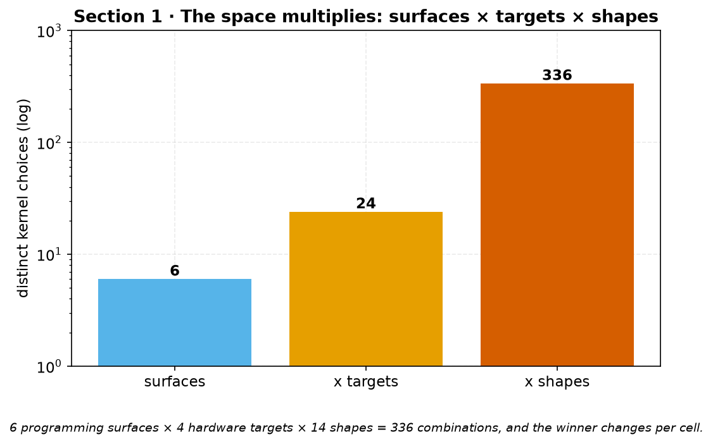

*Figure 1. The choice space multiplies: 6 programming surfaces × 4 hardware targets × 14
measured shapes. The winner changes per cell, so a single tuned recipe does not generalize.
(Counts from the surfaces named in this section, the four targets below, and the 13 measured
GB10 configs + config 14.)*

<details><summary>Alternative visual for Section 1</summary>

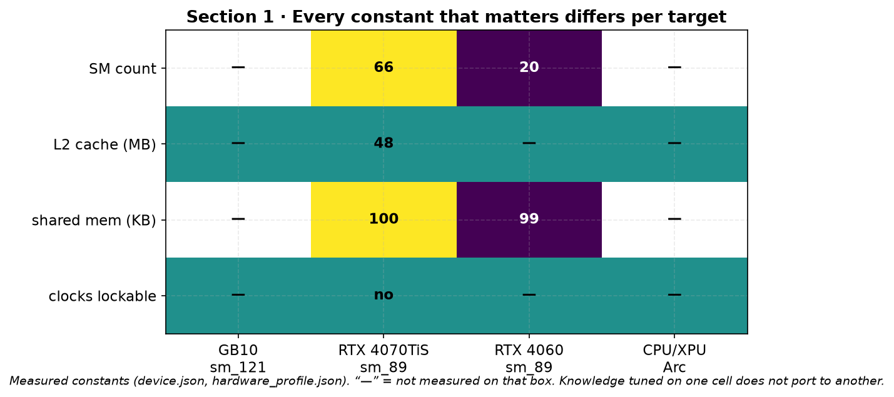

*Figure 1-alt. Every constant that matters differs per target — SM count, L2 size, shared
memory, whether clocks lock at all — so knowledge tuned on one box does not port. Values are
the real measured constants from `ledger/device.json` and
`research/experiments/hardware_validation/hardware_profile.json`; “—” marks constants not
measured on that box.*

</details>

## 2. What we noticed by tinkering manually

Hand-optimizing first showed the space is far smaller than it looks: a few cheap
measurements delete most of it.

- **Launch structure is invariant.** A census inside the replayed CUDA graph counted
  **exactly 36 kernels per forward on three wildly different configs** (0.061–6.549 ms),
  identically decomposed: 16 GEMMs, 9 LayerNorms, 4 attention, 4 GELU, 3 copies.
  `v34_launch_bound` then removed 16 of the 36.
- **Most "obvious" wins are already taken.** We priced L2 weight eviction at 16 ms. The
  kernel measured **2.1% above a streaming floor built from its own activation traffic** —
  768 KiB of weights against a 327 MB stream. A positive control moved the instrument 42.7%;
  the real effect was 0.25%.
- **Correctness is a wall, not a knob, and the famous algorithm sometimes loses.** bf16
  failed the accuracy gate on all 13 configs (26 ledger rows); an fp16 residual was ~1.4×
  faster and failed 11 of 13. At matched fp32 our FlashAttention-2 kernel ran **6.25× at
  head_dim 32 but 0.58× at head_dim 256**.
- **Assumptions hide in the harness.** The benchmark itself can carry an unstated default
  that inflates every result — so the measured win is partly an artifact of the test setup,
  not the kernel. Every early number used `padding_ratio=0.0`, the only value taking the fast
  path. At 0.5, config 13 fell from 24.06× to 6.62×; a corrected right-padded-causal proof
  later restored 5.85× where the naive path gave 2.86×.

Infeasibility and correctness prune far more of the space than tuning explores. In
comparable spaces **68–78% of configurations fail to compile** — failures are the dataset.

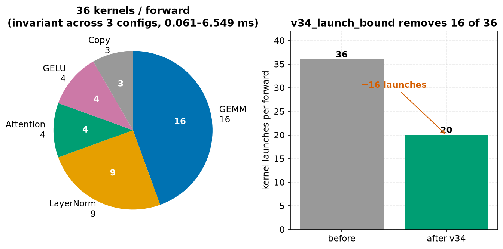

*Figure 2. The launch structure is invariant: a census inside the replayed CUDA graph counts
exactly 36 kernels per forward (16 GEMM, 9 LayerNorm, 4 attention, 4 GELU, 3 copy) on three
configs spanning 0.061–6.549 ms. `v34_launch_bound` then removes 16 of the 36.*

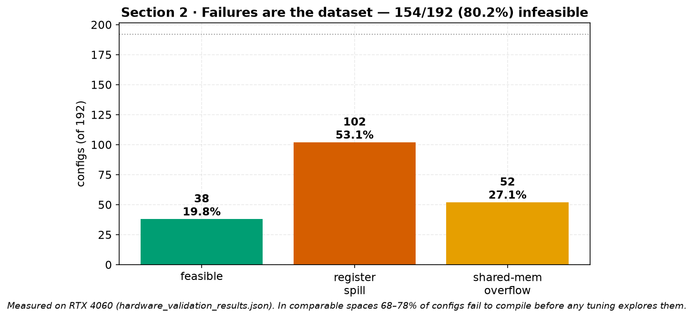

*Figure 3. Failures are the dataset. On the RTX 4060, 4 device constraints mark 154/192
(80.2%) of the space infeasible before tuning ever runs — 102 to register spill, 52 to
shared-memory overflow. (Source: `research/experiments/hardware_validation/hardware_validation_results.json`.)*

<details><summary>More Section 2 visuals (choose any)</summary>

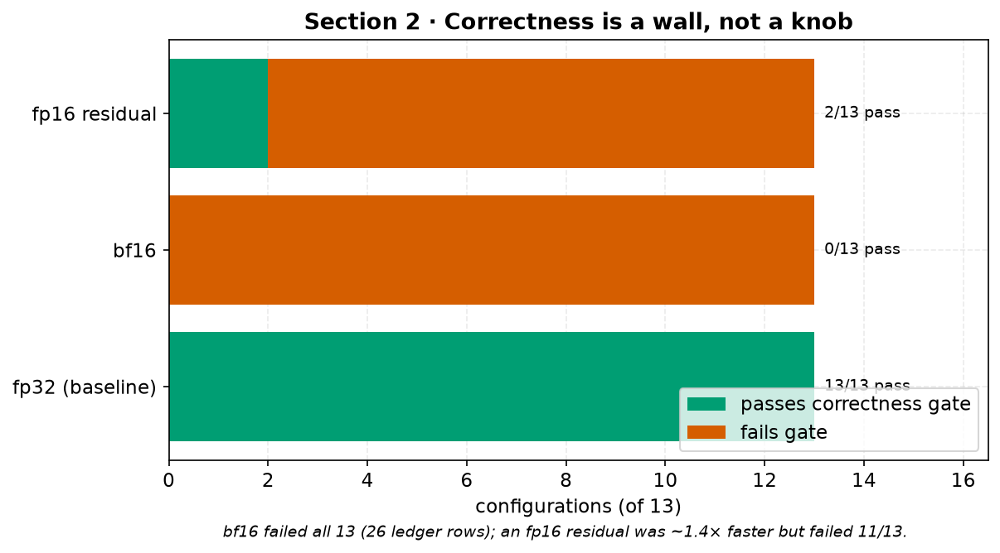

*Figure 2-alt-a. Correctness is a wall, not a knob: bf16 fails the accuracy gate on all 13
configs (26 ledger rows) and an fp16 residual (~1.4× faster) fails 11 of 13.*

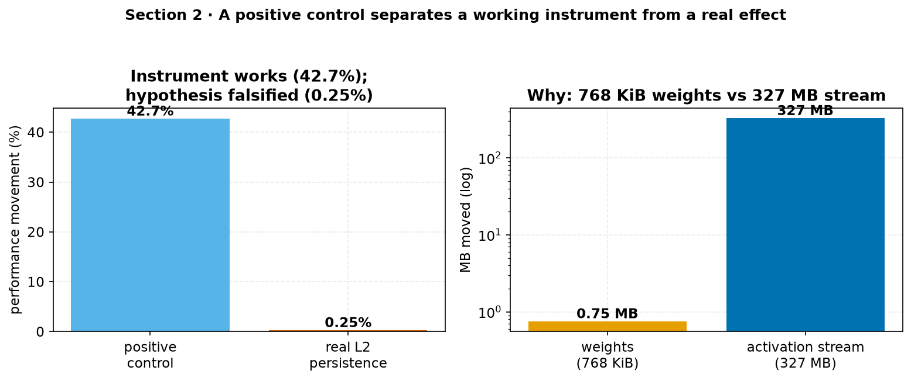

*Figure 2-alt-b. A positive control moved the instrument 42.7%, proving it works — but the
real L2 weight-persistence effect was only 0.25%, because 768 KiB of weights are negligible
beside a 327 MB activation stream.*

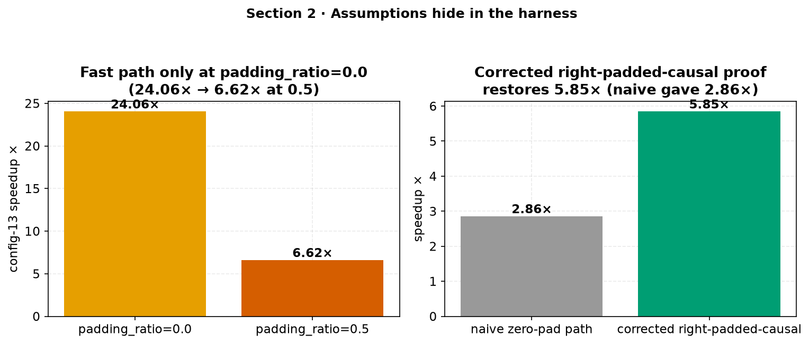

*Figure 2-alt-c. Assumptions hide in the harness: config 13 fell from 24.06× to 6.62× once
`padding_ratio` left the fast path (0.0 → 0.5), and a corrected right-padded-causal proof
later restored 5.85× where the naive path reported 2.86×.*

</details>

## 3. The automated loop

Ratchet automates **Compile → Execute → Benchmark → Optimize → Repeat**. A proposer emits a
candidate, a correctness gate runs *before* any timer, the harness measures, and the row is
appended to a hash-chained, commit-keyed ledger (698 rows on one branch, 104 on another,
across 42 generations). Only gains beyond the noise floor promote.

**The profiling system is the hard part**: a naive timer happily credits your kernel with
the whole model. Ours isolates kernel impact five ways.

1. **Matched-precision decomposition.** Each config reports `flash fp32` — our attention
   against the baseline's at *identical dtype*, so the ratio is purely the algorithm — then
   again at fp16 to price the tensor-core factor. That is how we know config 8's 3.79× win
   comes from dtype, not flash (0.58×).
2. **Exclusive-GPU enforcement.** A guard walks `/proc`, rejects any foreign process on the
   device, and records the check in the row. Two models in one process once inflated a
   baseline **4.1× (2037 ms vs a true 446 ms)**.
3. **One arm per subprocess**, locked tolerances (`rtol=0.02`, `atol=0.002`), and
   median/min-of-N sized from a measured per-call estimate. We caught
   `do_bench(warmup, rep)` taking *milliseconds, not iterations*: the default gave one
   unwarmed sample and a phantom 7.17× that re-runs read as 6.30–6.54×.
4. **A published noise floor.** ±7% on WSL2, from replicates. Re-timing byte-identical code
   moved the geomean +2.9%; A/B controls bounded it at 0.9811×–1.0046×.
5. **Probes may propose, never conclude.** One change measured 3.84× better op-level, 16.2%
   worse model-level, and +0.4% in the authoritative sweep.

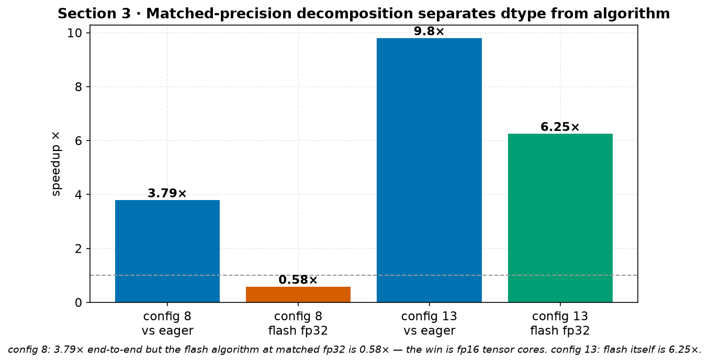

*Figure 4. Matched-precision decomposition. config 8 wins 3.79× end-to-end, but its
FlashAttention kernel at matched fp32 is only 0.58× — the win is fp16 tensor cores, not the
algorithm. config 13's flash kernel is genuinely 6.25×. (Source: GB10 table, `summary.md`.)*

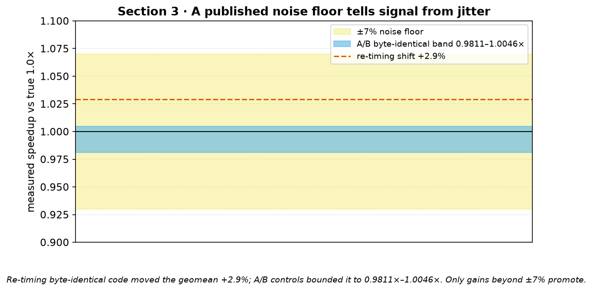

*Figure 5. A published ±7% noise floor separates signal from jitter. Re-timing byte-identical
code moved the geomean +2.9%; A/B controls bounded byte-identical variation to 0.9811×–1.0046×.
Only gains beyond the floor promote.*

<details><summary>More Section 3 visuals (choose any)</summary>

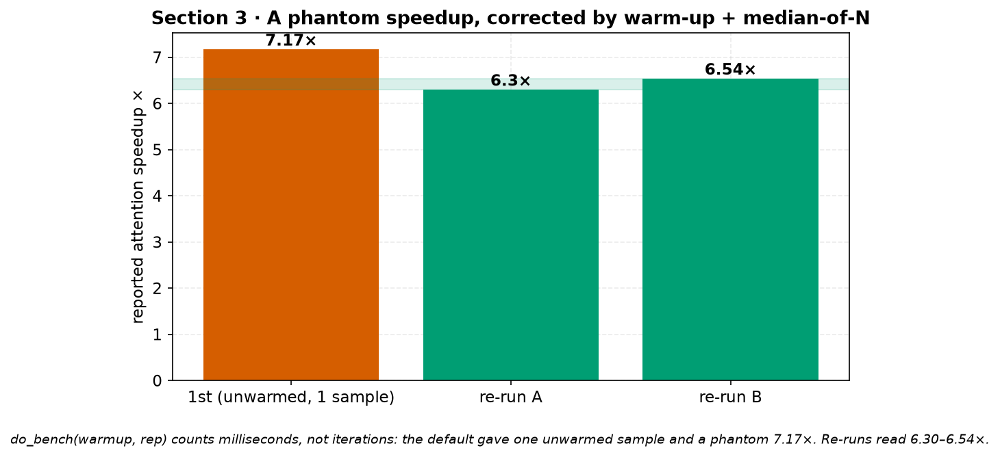

*Figure 5-alt-a. `do_bench(warmup, rep)` counts milliseconds, not iterations: the default
gave one unwarmed sample and a phantom 7.17×, which re-runs read as 6.30–6.54× once warm-up
and median-of-N were fixed.*

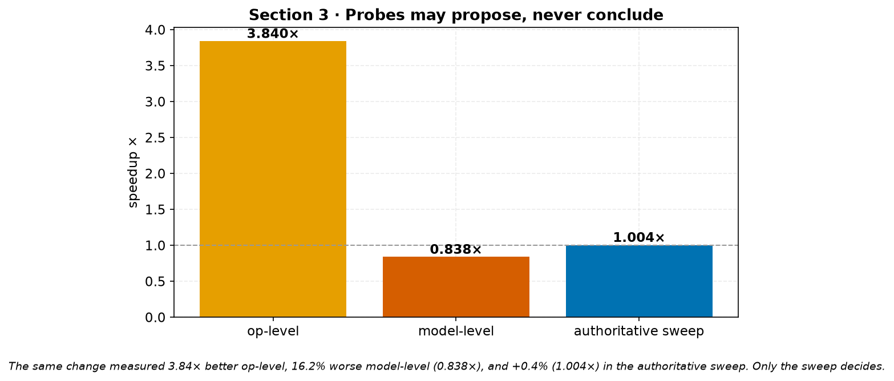

*Figure 5-alt-b. The same change measured 3.84× op-level, 0.838× (−16.2%) model-level, and
1.004× (+0.4%) in the authoritative sweep. Only the sweep decides.*

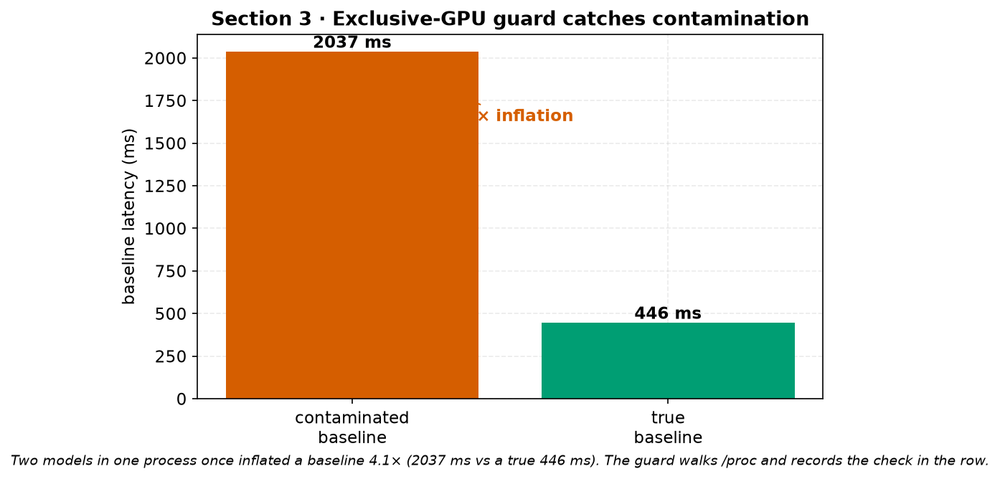

*Figure 5-alt-c. Two models sharing one process once inflated a baseline 4.1× (2037 ms vs a
true 446 ms). The exclusive-GPU guard walks `/proc` and records the check in the row.*

</details>

## 4. Where humans inject expertise

Expertise enters through an append-only, hash-chained planning queue with five record kinds:
`IDEA`, `CONSTRAINT`, `PRIORITY`, `LITERATURE`, `REDIRECT`. You open a question, forbid an
outcome ("no result from a single sequence length"), reorder the search, or retire a line of
attack — and you can never edit history. Literature keys are validated against ten papers
actually read (FlashAttention 1/2, PyTorch 2/Inductor, GPU autotuning, PyTorch XPU), so
priors are cited rather than asserted. Disagreeing means appending a `REDIRECT`, which keeps
your veto in the permanent record.

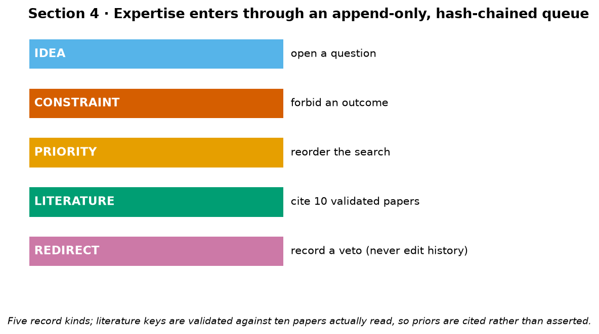

*Figure 6. Expertise enters through an append-only, hash-chained planning queue with five
record kinds. Literature keys are validated against ten papers actually read, so priors are
cited rather than asserted.*

<details><summary>Alternative visual for Section 4</summary>

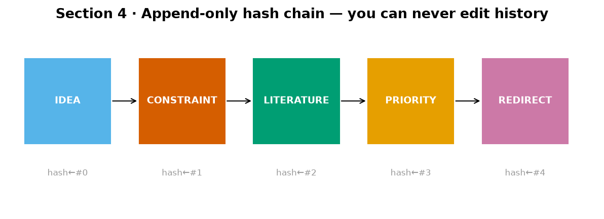

*Figure 6-alt. The queue is a hash chain: each record links to the previous digest, so history
can be appended (including a `REDIRECT` veto) but never edited.*

</details>

## 5. Results

| Evidence                         | Result                                                                                                  |
| -------------------------------- | ------------------------------------------------------------------------------------------------------- |
| GB10, 13 correct configs         | **3.20× geomean vs eager**, **2.62× vs `torch.compile`**; best config 9.80×            |
| RTX 4070 Ti SUPER                | **3.25× geomean vs a compiled baseline** (v34), traced 0.79× → 3.25× over 34 generations      |
| Attention kernel, matched fp32   | 1.15×–6.25× where it helps; 0.58× where it does not                                                 |
| Failure-aware pruning (RTX 4060) | compile failures**30.6% → 0%**, 82 wasted evals → 0, best 1.68× → 1.53×                      |
| Constraint soundness             | 4 device constraints correctly reject 80.2% of a 192-config space                                       |
| Difficulty forecasting           | failure-weighted PageRank Spearman**0.432/0.335/0.433/0.333** vs plain PageRank **−0.517** |
| CPU-only branch                  | `EVT-000001`, a *no-run* — zero fabricated numbers                                                 |

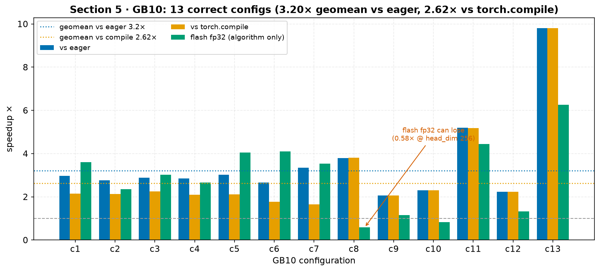

*Figure 7. GB10, 13 correct configs. vs eager (3.20× geomean), vs `torch.compile` (2.62×
geomean), and the flash-fp32 algorithm-only ratio. Best config 9.80×; flash fp32 can even
lose (0.58× at head_dim 256), which is why matched-precision decomposition matters. (Source:
GB10 table, `summary.md`.)*

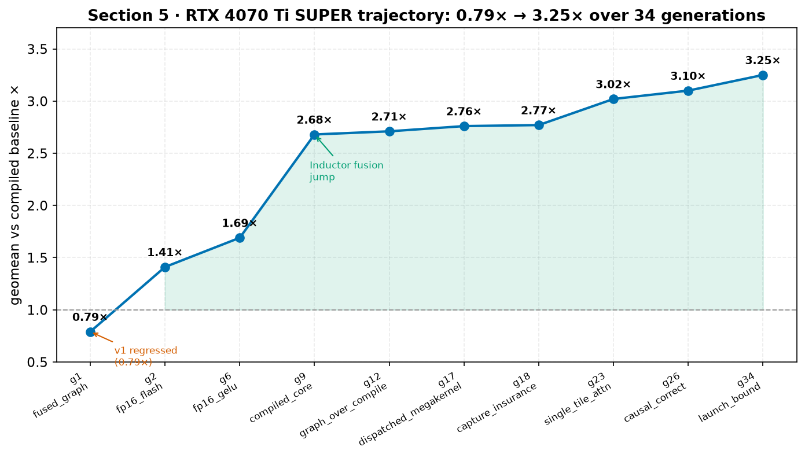

*Figure 8. The RTX 4070 Ti SUPER trajectory over 34 generations: 0.79× (v1 regressed) → 3.25×
(`v34_launch_bound`), with the largest jump when Inductor fusion entered at v9a. Each point is
a composite candidate's geomean vs the compiled baseline, not additive effects. (Source: `summary.md`.)*

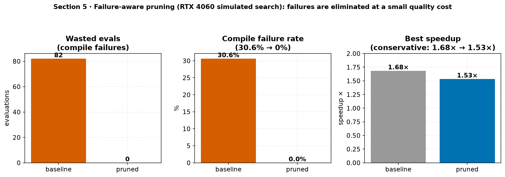

*Figure 9. Failure-aware pruning (RTX 4060 seeded search): compile failures 30.6% → 0% and 82
wasted evals → 0, at a small, honest quality cost (best 1.68× → 1.53×). (Source:
`research/experiments/failure_aware_pruning/results.json`.)*

<details><summary>More Section 5 visuals (choose any)</summary>

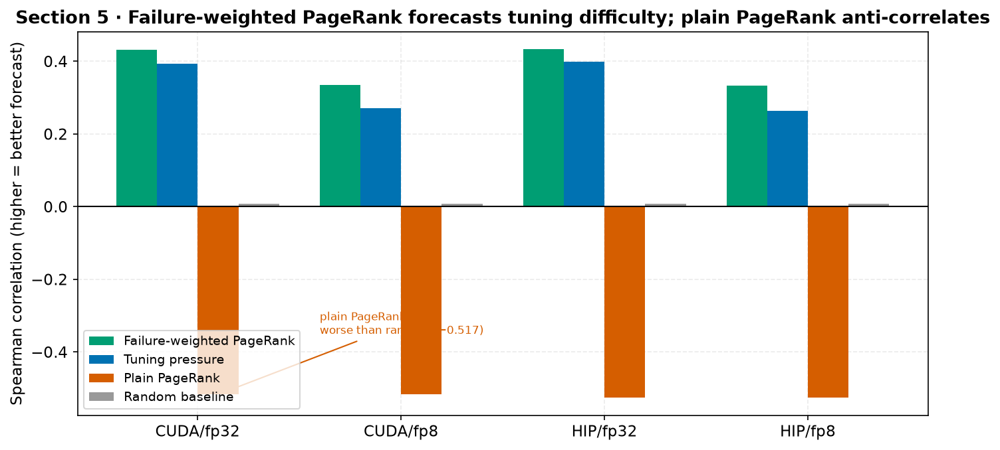

*Figure 7-alt-a. Difficulty forecasting: failure-weighted PageRank is the best Spearman
correlation in all four synthetic scenarios (0.333–0.433) while plain PageRank anti-correlates
(−0.517). (Source: brian synthetic table, `summary.md`.)*

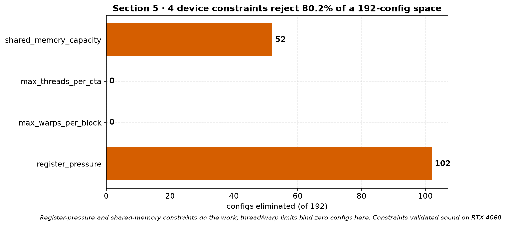

*Figure 7-alt-b. Four device constraints correctly reject 80.2% of a 192-config space;
register-pressure (102) and shared-memory (52) constraints do the work, thread/warp limits
bind zero here. (Source: `hardware_validation_results.json`.)*

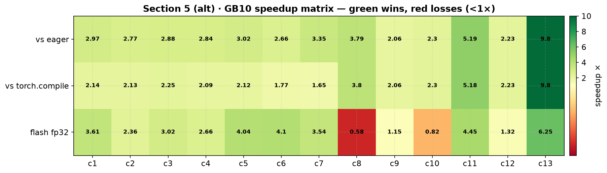

*Figure 7-alt-c. The same 13×3 GB10 matrix as a heatmap — green wins, red losses (<1×) — a
compact alternative to the grouped bars in Figure 7.*

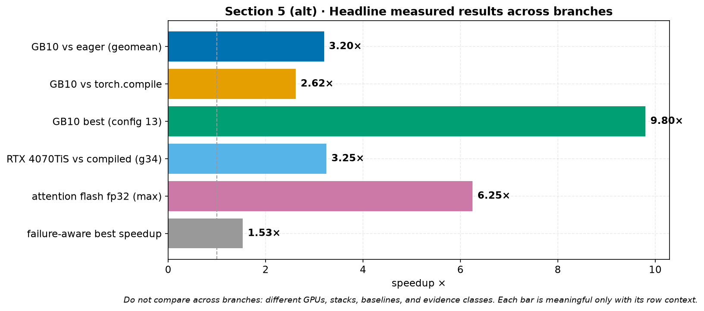

*Figure 7-alt-d. Headline measured results across branches. Do not compare bars across
branches: different GPUs, stacks, baselines, and evidence classes; each is meaningful only in
its row context.*

</details>

## 6. Deploying this anywhere

Two commands:

```bash
./scripts/verify-autoresearch.sh          # verify archive, rebuild paper, run gates
python -m ratchet.backends --backend xpu|cuda|hip
```

A new target ships only after passing the vendor qualification hierarchy; until then
dispatch is fail-closed. Each researcher or agent takes a named **lane** in an isolated
worktree bound to an exact base commit and protocol digest, and `consolidate()` merges lanes
deterministically, reporting conflicts instead of resolving them. Read state as a PDF or the
web dashboard; write only by appending. Point it at your GPU and the loop returns a dispatch
table calibrated to *your* silicon.
